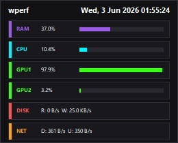

# wperf

A lightweight Windows desktop performance overlay. Sits at the bottom of the Z-order (behind all windows) and displays live system metrics with a minimal dark UI.



## Features

- **RAM** — memory usage %
- **CPU** — total processor load %
- **GPU** — per-adapter 3D engine utilisation % (all physical adapters)
- **DISK** — physical disk read / write throughput
- **NET** — network download / upload speed (physical interfaces only)
- Live clock in the header
- Remembers window position across restarts
- Right-click context menu with **Settings** and **Exit**

## Settings

Right-click the overlay to open Settings:

| Option | Description |
|---|---|
| Update interval (ms) | How often metrics refresh (250 – 60 000 ms, default 1 000) |
| Always on top | Float above all windows instead of sitting behind them |

Settings are saved to `wperf.ini` next to the executable.

## Requirements

- Windows 10 or later (x64)
- A DirectX 11-capable GPU for GPU metrics

## Building

```
cmake -B build
cmake --build build --config Release
```

Requires **CMake 4.2+** and **Visual Studio 2019+** (MSVC with C++20).

## Download

Pre-built releases are available on the [Releases](../../releases) page.

## License

[MIT](LICENSE) © 2026 taqu
