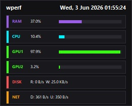

# wperf

A lightweight Windows desktop performance overlay. `wperf` sits at the bottom of the Z-order (behind all open windows) and displays live system metrics in a compact dark UI.



## Features

- **CPU** — total processor load %
- **RAM** — memory usage % with used / available in GB
- **GPU** — per-adapter 3D engine utilisation % and VRAM used (all physical adapters)
- **DISK** — physical disk read / write throughput
- **NET** — network download / upload speed (physical interfaces only)
- Live clock in the header
- Window position remembered across restarts
- Configurable update interval (250 – 60,000 ms)
- Always-on-top mode
- On-demand working-set memory purge
- On-demand Lock Inspector with graphical and command-line interfaces, Restart Manager fast scan, and optional native deep scan
- Explicit per-process Close Normally and confirmed Force Terminate actions in the Lock Inspector GUI
- Right-click context menu: **Settings**, **Purge Memory**, **Exit**

## Design Goals

`wperf` is intended to remain a lightweight resident tool.

- Idle resource usage stays minimal. The overlay updates on a configurable timer and suspends rendering when minimized.
- The process runs at background priority.
- Expensive operations such as memory purge and Lock Inspector are activated on demand and introduce no continuous background polling, threads, or handle scans while inactive.
- `wperf` is not a Task Manager replacement.

## Requirements

**To run:**
- Windows 10 or Windows 11, x64
- A DirectX 11-capable GPU is required for GPU metrics; all other metrics function without one

**No installation is required.** `wperf.exe` is a standalone executable.

**To build:** see [Building from Source](#building-from-source) below.

## Getting Started

No pre-built release is published yet. Build from source using the instructions below.

Once a release is available, download `wperf.exe` from the [Releases](../../releases) page and run it directly.

## Usage

Run `wperf.exe`. The overlay appears on the desktop, positioned behind all other windows by default.

**Right-click the overlay** to access the context menu:

| Action | Description |
|--------|-------------|
| Settings | Opens the Settings dialog |
| Purge Memory | Trims the working set of all accessible processes on demand |
| Exit | Closes the application |

**Settings dialog:**

| Option | Description |
|--------|-------------|
| Update interval (ms) | How often metrics refresh (250 – 60,000 ms, default 1,000) |
| Always on top | Float above all windows instead of sitting behind them |

The overlay has no system tray icon.

## Building from Source

Requires **CMake 4.2+** and **Visual Studio 2022** with the Desktop development with C++ workload (MSVC v143, C++20).

```
cmake -S . -B build -A x64
cmake --build build --config Release
```

Output: `build/Release/wperf.exe`

See [docs/build.md](docs/build.md) for Debug build steps, clean-build procedure, runtime dependency details, and troubleshooting.

## Configuration

Settings are stored in `wperf.ini` in the same directory as `wperf.exe`. The file is created automatically on first run.

`wperf` does not require administrator privileges. The memory purge feature may silently skip system-owned or otherwise protected processes when run as a standard user.

If `wperf.exe` is placed in a write-protected directory such as `C:\Program Files\`, settings will not persist. Run from a user-writable location.

## Known Limitations

- Windows x64 only. x86 is not supported.
- Windows 10 x64 support is documented but has not been independently tested. Windows 11 x64 is the verified platform.
- GPU monitoring requires a DirectX 11-capable GPU with WDDM 2.0 or later drivers. GPU metrics are absent on unsupported hardware.
- No installer. `wperf.exe` is distributed as a standalone executable.
- No published release yet.
- Settings file must be writable at the executable's location.

## Roadmap

Open the on-demand **Lock Inspector GUI** with `wperf.exe --lock-ui [path]`. Select a process to request a normal close or explicitly confirm force termination (which may lose unsaved data). The CLI remains read-only: `wperf.exe --lock "C:\project\output.dll" [--deep] [--json]`. Normal scans use Windows Restart Manager; explicit deep scans add native handle discovery, including directory descendants. Unicode paths are supported, with no background scanning while idle or closed. Protected processes and path aliases limit coverage. See [usage and limitations](docs/lock-inspector.md).

See [docs/roadmap.md](docs/roadmap.md) for the full development roadmap.

## Documentation

| Document | Description |
|----------|-------------|
| [docs/build.md](docs/build.md) | Complete build instructions |
| [docs/testing.md](docs/testing.md) | Automated tests and remaining manual checks |
| [docs/lock-inspector.md](docs/lock-inspector.md) | Lock Inspector GUI, CLI, API and limitations |
| [docs/supported-platforms.md](docs/supported-platforms.md) | Supported platforms and toolchain details |
| [docs/project-baseline.md](docs/project-baseline.md) | Technical repository baseline |
| [docs/release-policy.md](docs/release-policy.md) | Versioning and release quality gates |
| [docs/roadmap.md](docs/roadmap.md) | Development roadmap |

## License

[MIT](LICENSE) © 2026 taqu
